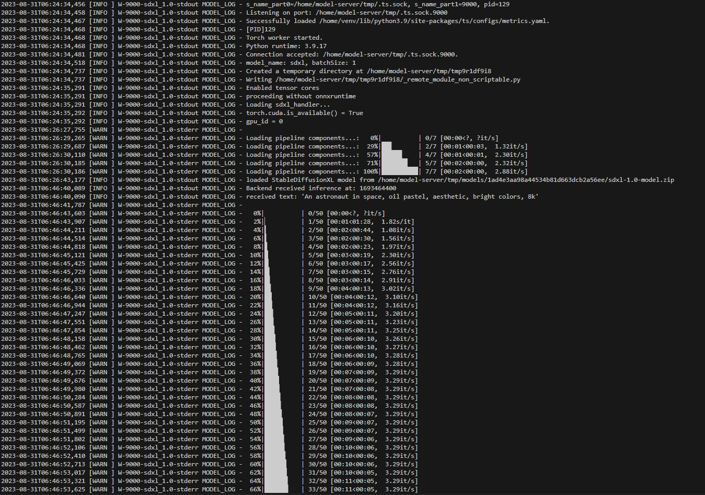
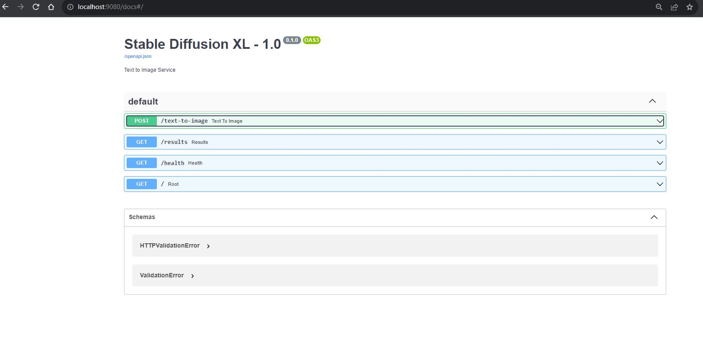
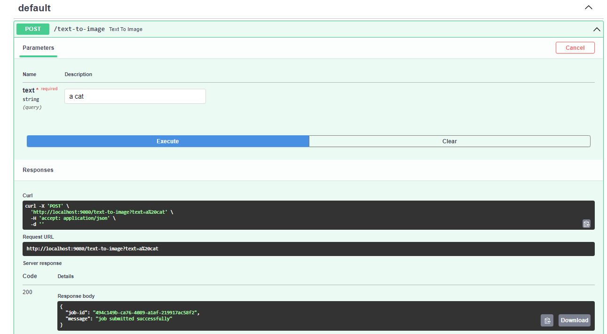
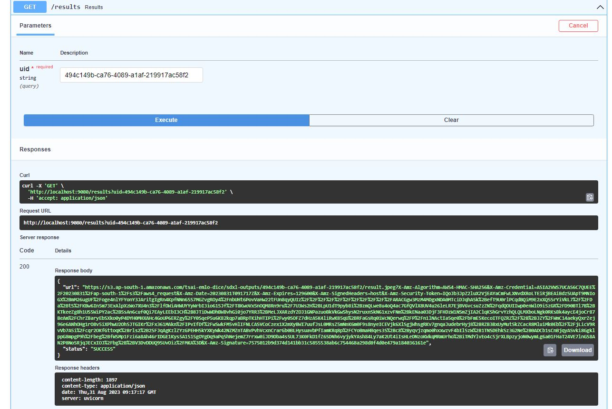
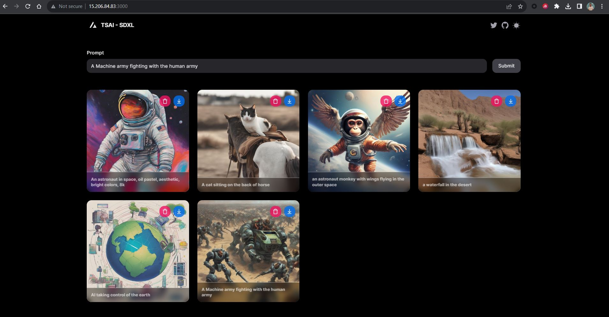

# Implementation of Stable Defusion XL (SDXL) model using TorchServe

## Objective
-  Download the stable defusion model form hugging face
- Using the torchserve handler create the "sdxl.mar" file
- Use the fastapi server to handle and manage the requests 
- Use the Next.js as frontend to create the user request and show the output images
- Use the Amazon EC2 instance to run the model and S3 buckets to manage the output

## Approach

### 1. Creating the MAR file and starting the torchserve server
- Using the [download_model.py](download_model.py), downloaded and save the SDXL-base model
- Using the [zip_model.sh](zip_model.sh), All the model artifacts have to be zipped which will be used by our torch serve handlers
- Run the torchserver docker container to create the model archive file
    ```
    docker run -it --rm --shm-size=1g --ulimit memlock=-1 --ulimit stack=67108864 --gpus all -v `pwd`:/opt/src pytorch/torchserve:0.8.1-gpu torchserve bash
    ```
- Created "MAR" from handler and model artifact
    ```
    torch-model-archiver --model-name sdxl --version 1.0 --handler sdxl_handler.py --extra-files sdxl-1.0-model.zip -r requirements.txt
    ```
- Created config.properties which will be used to configure the torchserve variables
    ```
    #Sample config.properties. In production config.properties at /mnt/models/config/config.properties will be used
    inference_address=http://0.0.0.0:8080
    management_address=http://0.0.0.0:8081
    metrics_address=http://0.0.0.0:8082
    enable_envvars_config=true
    install_py_dep_per_model=true
    load_models=all
    max_response_size=655350000
    model_store=/tmp/models
    default_response_timeout=600
    enable_metrics_api=true
    ```
- Started the torchserve server which loads all models in /home/ec2-user/Session13/torchservce by default
```
docker run --rm --shm-size=1g         --ulimit memlock=-1         --ulimit stack=67108864         -p8080:8080         -p8081:8081         -p8082:8082         -p7070:7070         -p7071:7071 --gpus all -v /home/ec2-user/Session13/torchservce/config.properties:/home/model-server/config.properties         --mount type=bind,source=/home/ec2-user/Session13/torchservce,target=/tmp/models pytorch/torchserve:0.8.1-gpu torchserve --model-store=/tmp/models
```
- Tested the SDXL Endpoint for Image generation using [test_endpoint.py](test_endpoint.py)

### 2. FastAPI Server Setup
- Using the FastAPI server as the request handler and session manager
- [Server.py](fastapi/server.py) file handles the text-to-image requests from the user.
- It create a uid for each request against which images will be saved in AWS S3 bucket
- Uid requests remains in the pending status while torchserver model is building the images
- Once the images are generated AWS S3 image url has been generated against each UID
- Created the [Dockerfile](fastapi/Dockerfile) to run the fastapi server in docker container

### 3. Next.js Server as User frontend
- Clone the following github repo to create the node js front end.
    https://github.com/satyajitghana/sdxl-ui
- In [env.local](frontend/sdxl-ui/.env.local) put the "NEXT_PUBLIC_BACKEND_URL" with SDXL FastAPI Server Endpoint
- Created the [Dockerfile](frontend/sdxl-ui/Dockerfile) to run the next.js app inside the docker container.

### 4 Docker Compose Setup
- Docker compose run three services : Torchserve, Fastapi and Frontend (Next.js)
    ```
    docker-compose build
    docker-compose up
    ```
- For Torchserve service, we are directly using the torchserve image by passing the ports, model and config file for the execution on GPU device


- For Fastapi its using the dockerfile and hosting the server on 9080 port. 

We can pass on the text to the swagger and it generates a uid.

Onces processed by the torchserve, we get the aws s3 image url. 


- For Frontend(Node.js) its using the docker file and hosting the frontend for user on 3000

- Some output images genereated by the torchserve model


### Notes
- When we run docker compose it creates a internal docker network to communicate between the different container services
- We can call the one service api from other by the service name. For example: We are calling the torchserve in fastapi for inferencing using the following url
    ```
    response = requests.get("http://torchserve:8080/    predictions/sdxl", data=text)

    ```
- When we access the docker service from browser, its outside docker network and we can't use the service name in the url, therefore we have to use the server ip to access the service from the browser. [env.local](frontend/sdxl-ui/.env.local)
    ```
    NEXT_PUBLIC_BACKEND_URL=http://15.206.84.83:9080
    ```
## Team
- Anurag Mittal
- Aman Jaipuria